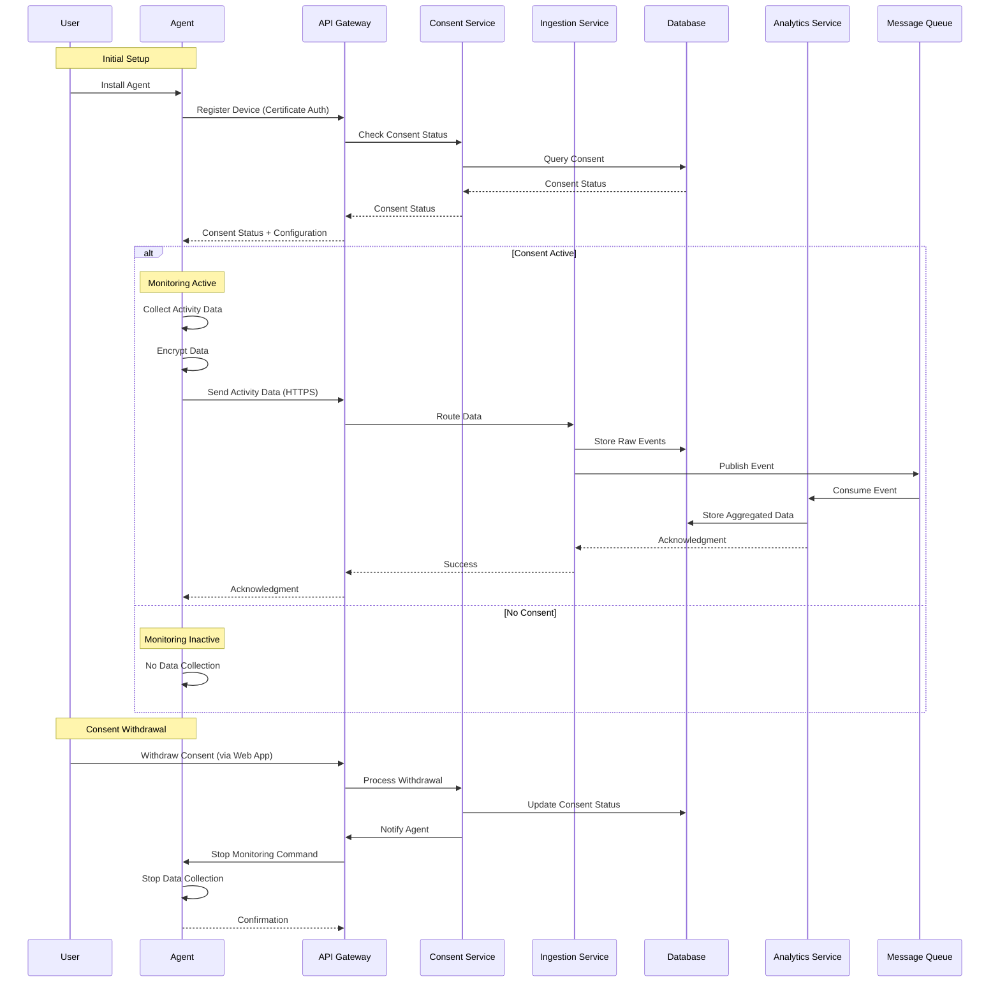

# Agent-Backend Communication Flow

> **Icarus Nova** | Detailed flow of data collection, transmission, and processing between the monitoring agent and backend services.

## Overview

This diagram illustrates the complete flow of data from the monitoring agent on the user's device through to the backend services, including consent enforcement, data encryption, and processing.

## Communication Flow Diagram

## Detailed Flow Steps

### 1. Agent Installation and Registration

**Step 1.1: Agent Installation**
- User installs agent on their device
- Agent generates device certificate
- Agent stores certificate securely
- Agent initializes with minimal configuration

**Step 1.2: Device Registration**
- Agent connects to API Gateway
- Agent authenticates with device certificate
- API Gateway validates certificate
- API Gateway registers device

**Step 1.3: Consent Check**
- API Gateway queries Consent Service
- Consent Service checks Database for user consent
- Consent status returned to Agent
- Agent configures based on consent status

### 2. Data Collection (With Consent)

**Step 2.1: Activity Monitoring**
- Agent monitors system events:
  - Application launches/closes
  - Window focus changes
  - System idle/active states
  - Network activity (volume only)
- Agent does NOT collect:
  - Keystrokes
  - Screen content
  - File contents
  - Personal communications

**Step 2.2: Data Buffering**
- Agent buffers events locally
- Events stored in encrypted local buffer
- Buffer size limited (e.g., 1000 events)
- Buffer flushed periodically or on size limit

**Step 2.3: Data Encryption**
- Agent encrypts buffered data
- Uses TLS for transport encryption
- Additional payload encryption for sensitive data
- Encryption keys managed securely

**Step 2.4: Data Transmission**
- Agent sends encrypted data to API Gateway
- Uses HTTPS with certificate pinning
- Automatic retry on failure
- Exponential backoff for retries

### 3. Backend Processing

**Step 3.1: API Gateway Processing**
- API Gateway authenticates request
- API Gateway validates data format
- API Gateway applies rate limiting
- API Gateway routes to Ingestion Service

**Step 3.2: Data Ingestion**
- Ingestion Service validates data
- Ingestion Service checks consent status
- Ingestion Service enriches data (timestamp, device info)
- Ingestion Service stores in Database

**Step 3.3: Event Publishing**
- Ingestion Service publishes event to Message Queue
- Event includes metadata and data
- Event tagged with user, organization, timestamp
- Event persisted in queue

**Step 3.4: Analytics Processing**
- Analytics Service consumes events from queue
- Analytics Service aggregates data
- Analytics Service calculates metrics
- Analytics Service stores aggregated data

**Step 3.5: Acknowledgment**
- Analytics Service acknowledges event
- Ingestion Service confirms processing
- API Gateway returns success to Agent
- Agent clears local buffer

### 4. Consent Management

**Step 4.1: Consent Activation**
- User provides consent via Web Application
- Consent stored in Database
- Consent Service notifies Agent
- Agent activates monitoring

**Step 4.2: Consent Withdrawal**
- User withdraws consent via Web Application
- Consent status updated in Database
- Consent Service notifies Agent
- Agent stops data collection immediately
- Existing data retained per retention policy

**Step 4.3: Policy Updates**
- Policy changes require new consent
- Users notified of policy changes
- New consent version created
- Agent updated with new policy version

## Error Handling

### Network Failures

**Agent Behavior:**
- Retry with exponential backoff
- Maximum retry attempts (e.g., 5)
- Local buffer retention
- Offline mode support

**Backend Behavior:**
- Idempotent operations
- Duplicate detection
- Event ordering
- Dead letter queue for failures

### Consent Violations

**Detection:**
- Ingestion Service checks consent before processing
- Rejects data if consent not active
- Logs violation for audit
- Notifies administrators

**Response:**
- Data rejected
- Agent notified
- Audit log entry
- Alert to administrators

### Data Validation Failures

**Validation:**
- Schema validation
- Data type validation
- Range validation
- Business rule validation

**Response:**
- Invalid data rejected
- Error logged
- Agent notified
- Retry with corrected data

## Security Considerations

### Authentication

**Agent Authentication:**
- Certificate-based authentication
- Certificate pinning
- Mutual TLS (mTLS)
- Certificate rotation

**Backend Authentication:**
- Service-to-service authentication
- API keys for services
- OAuth for user access
- Token validation

### Encryption

**In Transit:**
- TLS 1.3+ for all communications
- Certificate pinning
- Perfect forward secrecy
- Strong cipher suites

**At Rest:**
- Database encryption
- Key management
- Encrypted backups
- Secure key storage

### Data Integrity

**Mechanisms:**
- Cryptographic hashes
- Digital signatures
- Checksums
- Integrity verification

## Performance Considerations

### Agent Performance

**Optimization:**
- Minimal CPU usage (< 1%)
- Minimal memory usage (< 50 MB)
- Efficient event collection
- Batch transmission

### Backend Performance

**Optimization:**
- Async processing
- Batch operations
- Caching
- Database optimization
- Horizontal scaling

### Network Optimization

**Strategies:**
- Data compression
- Batch transmission
- Efficient protocols
- Connection pooling

## Monitoring and Observability

### Agent Metrics

- Data collection rate
- Transmission success rate
- Buffer size
- Error rates
- Resource usage

### Backend Metrics

- Ingestion rate
- Processing latency
- Error rates
- Queue depth
- Database performance

### Alerts

- Consent violations
- High error rates
- Performance degradation
- Security events
- System failures

## Related Documents

- [C4 Container Diagram](./c4-container-diagram.md)
- [Encryption Flow](./encryption-flow.md)
- [Data Collection Boundaries](./data-collection-boundaries.md)
- [Agent Architecture](../agent/architecture.md)

---

**Last Updated:** 2024  
**Maintained by:** Icarus Nova Architecture Team  
**Version:** 1.0
