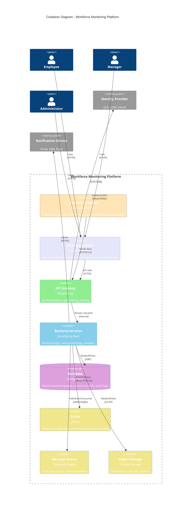

# C4 Container Diagram

> **Icarus Nova** | Container-level architecture showing the major components and their interactions.

## Overview

This C4 Container diagram shows the major containers (applications, data stores, file systems) that make up the Workforce Monitoring Platform and how they interact.

## Container Diagram

## Containers

### Monitoring Agent

**Technology**: Native application (C++, Go, or platform-specific)

**Responsibilities:**
- Collect activity data (application usage, window focus, system state)
- Enforce consent boundaries (no monitoring without consent)
- Encrypt data before transmission
- Minimal resource usage
- Secure communication with backend

**Key Features:**
- Lightweight and efficient
- Tamper-resistant
- Certificate-based authentication
- Local data buffering
- Automatic retry on failures

### Web Application

**Technology**: React/TypeScript, modern web framework

**Responsibilities:**
- User interface for consent management
- Data visualization and dashboards
- User account management
- Policy presentation
- Consent withdrawal interface

**Key Features:**
- Responsive design
- Accessibility (WCAG 2.1 AA)
- Real-time updates
- Multi-language support
- Secure session management

### API Gateway

**Technology**: Kong, Envoy, or similar

**Responsibilities:**
- Request routing
- Authentication and authorization
- Rate limiting
- Request/response transformation
- API versioning
- Security policies

**Key Features:**
- OAuth 2.0 / OpenID Connect
- Rate limiting per user/organization
- Request logging
- SSL/TLS termination
- Load balancing

### Backend Services

**Technology**: Java/Spring Boot, microservices architecture

**Responsibilities:**
- Business logic processing
- Data ingestion and validation
- Analytics and aggregation
- Consent management
- Audit logging
- Compliance reporting

**Key Services:**
- **Ingestion Service**: Receives and validates agent data
- **Analytics Service**: Processes and aggregates data
- **Consent Service**: Manages consent lifecycle
- **Reporting Service**: Generates reports and dashboards
- **Audit Service**: Maintains audit logs

### Database

**Technology**: PostgreSQL (primary), with read replicas

**Responsibilities:**
- Store monitoring data
- Store consent records
- Store audit logs
- Store user accounts and permissions
- Store configuration and policies

**Key Features:**
- ACID transactions
- Encryption at rest
- Backup and replication
- Query optimization
- Data retention enforcement

### Cache

**Technology**: Redis

**Responsibilities:**
- Session storage
- Rate limiting counters
- Temporary data storage
- Frequently accessed data
- Real-time metrics

**Key Features:**
- High performance
- Persistence options
- Clustering support
- TTL management

### Message Queue

**Technology**: RabbitMQ or Apache Kafka

**Responsibilities:**
- Async processing
- Event streaming
- Decouple services
- Batch processing
- Event sourcing

**Key Features:**
- Reliable delivery
- Scalability
- Message persistence
- Consumer groups

### Object Storage

**Technology**: S3, Azure Blob Storage, or similar

**Responsibilities:**
- File storage
- Backup storage
- Archive storage
- Large data objects
- Static assets

**Key Features:**
- Scalability
- Durability
- Encryption
- Lifecycle policies
- Access controls

## Container Interactions

### User to Web Application

**Flow:**
1. User accesses web application
2. Web application authenticates via Identity Provider
3. User interacts with UI
4. Web application makes API calls

**Protocol**: HTTPS
**Security**: TLS encryption, session management

### Agent to API Gateway

**Flow:**
1. Agent collects activity data
2. Agent encrypts data
3. Agent authenticates with certificate
4. Agent sends data to API Gateway
5. API Gateway validates and routes

**Protocol**: HTTPS/TLS
**Security**: Certificate-based authentication, encryption

### API Gateway to Backend

**Flow:**
1. API Gateway validates request
2. API Gateway routes to appropriate backend service
3. Backend processes request
4. Backend returns response
5. API Gateway returns to client

**Protocol**: Internal (HTTP/gRPC)
**Security**: Internal network, service authentication

### Backend to Database

**Flow:**
1. Backend service queries database
2. Database executes query
3. Database returns results
4. Backend processes results

**Protocol**: JDBC
**Security**: Encrypted connections, access controls

### Backend to Message Queue

**Flow:**
1. Backend publishes event
2. Message queue stores event
3. Consumer services process events
4. Events acknowledged

**Protocol**: AMQP/Kafka Protocol
**Security**: Authentication, encryption

## Data Flow

### Data Ingestion Flow

1. **Agent** collects activity data
2. **Agent** encrypts and sends to **API Gateway**
3. **API Gateway** authenticates and routes to **Backend**
4. **Backend** validates and stores in **Database**
5. **Backend** publishes events to **Message Queue**
6. **Analytics Service** processes events
7. Results stored in **Database** and **Cache**

### Consent Flow

1. **User** accesses **Web Application**
2. **Web Application** presents consent document
3. **User** provides consent via **Web Application**
4. **Web Application** sends to **API Gateway**
5. **API Gateway** routes to **Backend**
6. **Backend** stores consent in **Database**
7. **Backend** notifies **Agent** (via API)
8. **Agent** activates monitoring

### Data Retrieval Flow

1. **User** requests data via **Web Application**
2. **Web Application** calls **API Gateway**
3. **API Gateway** routes to **Backend**
4. **Backend** queries **Database** (with **Cache** check)
5. **Backend** returns data
6. **Web Application** displays data

## Security Boundaries

### External Boundary
- All external communications encrypted (TLS)
- Authentication required for all access
- Rate limiting and DDoS protection

### Internal Boundary
- Internal network isolation
- Service-to-service authentication
- Encrypted internal communications

### Data Boundary
- Encryption at rest
- Access controls
- Audit logging
- Data retention enforcement

## Scalability Considerations

### Horizontal Scaling
- **Agent**: Stateless, scales with users
- **Web Application**: Stateless, load balanced
- **API Gateway**: Stateless, load balanced
- **Backend Services**: Stateless, auto-scaling
- **Database**: Read replicas, sharding
- **Cache**: Clustered
- **Message Queue**: Partitioned, consumer groups

### Vertical Scaling
- Resource optimization
- Efficient algorithms
- Caching strategies
- Database optimization

## Related Documents

- [C4 System Context](./c4-system-context.md)
- [Agent-Backend Flow](./agent-backend-flow.md)
- [Encryption Flow](./encryption-flow.md)
- [Backend Architecture](../backend/architecture.md)

---

**Last Updated:** 2024  
**Maintained by:** Icarus Nova Architecture Team  
**Version:** 1.0
