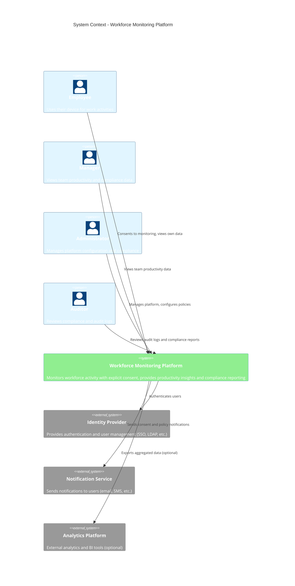

# C4 System Context Diagram

> **Icarus Nova** | High-level system context showing the workforce monitoring platform and its interactions with users and external systems.

## Overview

This C4 System Context diagram shows the Workforce Monitoring Platform at the highest level of abstraction, identifying the system's users, external dependencies, and key interactions.

## System Context Diagram

## Actors

### Primary Users

#### Employee
- **Role**: Subject of monitoring
- **Interactions**:
  - Provides explicit consent for monitoring
  - Views own monitoring data
  - Manages consent preferences
  - Exports personal data
  - Requests data deletion

#### Manager
- **Role**: Team productivity oversight
- **Interactions**:
  - Views aggregated team productivity data
  - Accesses compliance reports
  - Monitors team consent status
  - Reviews productivity insights

#### Administrator
- **Role**: Platform management
- **Interactions**:
  - Configures monitoring policies
  - Manages user accounts and permissions
  - Views system-wide analytics
  - Manages compliance settings
  - Configures data retention policies

#### Auditor
- **Role**: Compliance verification
- **Interactions**:
  - Reviews audit logs
  - Verifies consent records
  - Validates compliance with policies
  - Generates compliance reports

## External Systems

### Identity Provider
- **Purpose**: Authentication and user management
- **Examples**: 
  - Single Sign-On (SSO) providers
  - LDAP/Active Directory
  - OAuth providers
  - Custom identity systems
- **Integration**: 
  - User authentication
  - User provisioning
  - Role management

### Notification Service
- **Purpose**: User communications
- **Examples**:
  - Email services
  - SMS gateways
  - Push notification services
  - In-app notifications
- **Integration**:
  - Consent notifications
  - Policy update notifications
  - System alerts
  - User communications

### Analytics Platform (Optional)
- **Purpose**: Advanced analytics and BI
- **Examples**:
  - Business intelligence tools
  - Data warehouses
  - Analytics platforms
- **Integration**:
  - Aggregated data export
  - Analytics integration
  - Reporting integration

## System Responsibilities

### Workforce Monitoring Platform

**Core Responsibilities:**
1. **Consent Management**
   - Capture and store explicit consent
   - Manage consent versions
   - Handle consent withdrawal
   - Maintain consent audit trails

2. **Activity Monitoring**
   - Collect activity data (with consent)
   - Process and aggregate data
   - Generate productivity insights
   - Maintain data boundaries

3. **Privacy Protection**
   - Encrypt data in transit and at rest
   - Implement access controls
   - Enforce data minimization
   - Support user rights

4. **Compliance**
   - Maintain audit logs
   - Generate compliance reports
   - Support regulatory requirements
   - Enable data subject rights

5. **Analytics and Reporting**
   - Generate productivity metrics
   - Create compliance reports
   - Provide data visualizations
   - Support data export

## Key Interactions

### Employee Interactions

1. **Consent Flow**
   - Employee reviews consent document
   - Employee provides explicit consent
   - System activates monitoring
   - Employee can withdraw consent

2. **Data Access**
   - Employee views own data
   - Employee exports data
   - Employee requests corrections
   - Employee requests deletion

### Manager Interactions

1. **Productivity View**
   - Manager views team metrics
   - Manager accesses reports
   - Manager reviews trends
   - Manager exports data

2. **Compliance Monitoring**
   - Manager views consent status
   - Manager reviews compliance
   - Manager generates reports

### Administrator Interactions

1. **Platform Management**
   - Admin configures policies
   - Admin manages users
   - Admin views system metrics
   - Admin manages compliance

2. **System Configuration**
   - Admin sets retention policies
   - Admin configures monitoring scope
   - Admin manages integrations
   - Admin sets security policies

### Auditor Interactions

1. **Compliance Review**
   - Auditor reviews audit logs
   - Auditor verifies consent records
   - Auditor validates compliance
   - Auditor generates reports

## Trust Boundaries

### High Trust
- **Internal System Components**: Agent, Backend, Database
- **Identity Provider**: Authenticated and authorized
- **Encrypted Communications**: TLS-protected channels

### Medium Trust
- **User Devices**: User-controlled, potential compromise
- **Network Infrastructure**: Encrypted but potentially intercepted
- **External Services**: Contracted with security requirements

### Low Trust
- **Public Networks**: Untrusted infrastructure
- **External Attackers**: Malicious actors
- **Compromised Systems**: Potentially compromised environments

## Security Considerations

### Authentication
- All users authenticate via Identity Provider
- Multi-factor authentication for admins
- Certificate-based authentication for agents

### Authorization
- Role-based access control
- Least privilege principle
- Resource-level permissions

### Data Protection
- Encryption in transit (TLS)
- Encryption at rest
- Access controls
- Audit logging

## Related Documents

- [C4 Container Diagram](./c4-container-diagram.md)
- [Agent-Backend Flow](./agent-backend-flow.md)
- [Data Collection Boundaries](./data-collection-boundaries.md)

---

**Last Updated:** 2024  
**Maintained by:** Icarus Nova Architecture Team  
**Version:** 1.0
