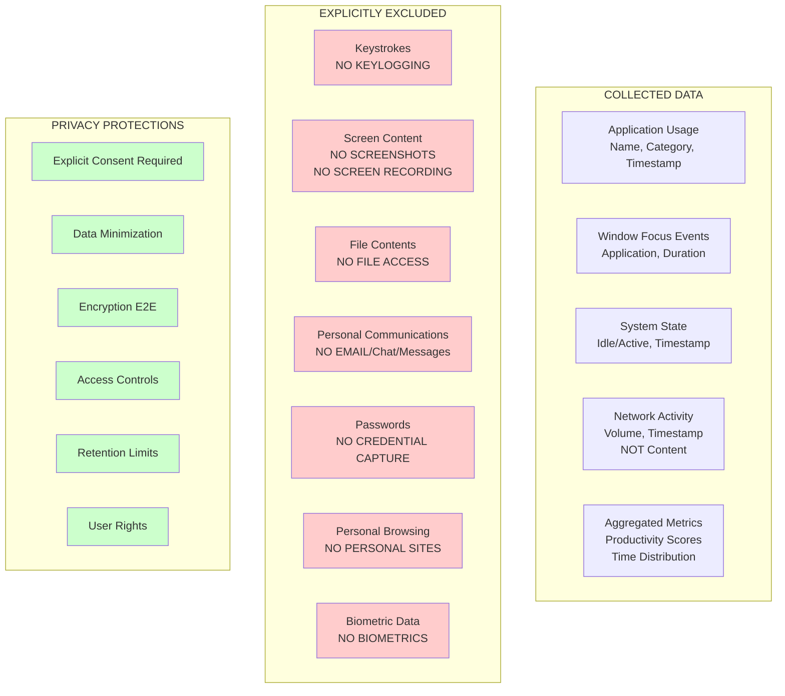

# Data Collection Boundaries

> **Icarus Nova** | Clear definition of what data is collected, what is NOT collected, and the explicit boundaries that protect user privacy.

## Overview

This document defines the explicit boundaries of data collection for the Workforce Monitoring Platform. It clearly delineates what is monitored, what is explicitly excluded, and the privacy protections in place. This is a **critical differentiator** that sets this platform apart from surveillance software.

## Data Collection Boundaries Diagram

## What We Collect

### Application Usage Data

**Collected:**
- Application name (e.g., "Microsoft Word", "Chrome")
- Application category (e.g., "Productivity", "Development")
- Launch timestamp
- Close timestamp
- Duration of usage

**Purpose:**
- Productivity analysis
- Time tracking
- Application usage patterns
- Compliance reporting

**Privacy Protection:**
- No content access
- No file access
- Aggregated when possible
- User-accessible

### Window Focus Events

**Collected:**
- Active window application name
- Window title (general, not sensitive)
- Focus start timestamp
- Focus end timestamp
- Duration of focus

**Purpose:**
- Activity tracking
- Productivity measurement
- Time distribution analysis

**Privacy Protection:**
- Window titles filtered for sensitive content
- No screen content capture
- Aggregated analysis
- User can review

### System State

**Collected:**
- System idle/active state
- State change timestamp
- Idle duration
- Active duration

**Purpose:**
- Productivity calculation
- Time tracking
- Activity patterns

**Privacy Protection:**
- No user activity details
- No content information
- Aggregated metrics
- Privacy-preserving

### Network Activity

**Collected:**
- Network traffic volume (bytes)
- Timestamp
- Direction (inbound/outbound)
- Protocol type (general)

**NOT Collected:**
- Network packet content
- URLs visited
- Domain names (unless for work categorization)
- Request/response content
- DNS queries

**Purpose:**
- Network usage analysis
- Productivity correlation
- Resource monitoring

**Privacy Protection:**
- No content inspection
- No URL tracking
- Volume metrics only
- Aggregated analysis

### Aggregated Metrics

**Collected:**
- Calculated productivity scores
- Time distribution by category
- Activity patterns (aggregated)
- Performance metrics

**Purpose:**
- Productivity insights
- Trend analysis
- Business intelligence
- Reporting

**Privacy Protection:**
- Derived from collected data
- No raw personal data
- Aggregated to protect privacy
- User-accessible

## What We Do NOT Collect

### ❌ Keystrokes

**Explicitly Excluded:**
- No keylogging under any circumstances
- No keyboard input capture
- No typing pattern analysis
- No password capture
- No sensitive input tracking

**Rationale:**
- Extreme privacy violation
- Security risk (password exposure)
- Not necessary for productivity analysis
- Legal and ethical concerns

**Technical Implementation:**
- Agent explicitly does not hook keyboard events
- No keyboard monitoring APIs used
- Code review ensures no keylogging
- Regular security audits

### ❌ Screen Content

**Explicitly Excluded:**
- No screenshots
- No screen recordings
- No screen capture
- No visual content collection
- No image analysis

**Rationale:**
- Complete privacy violation
- Captures sensitive information
- Not necessary for productivity
- Legal and compliance issues

**Technical Implementation:**
- No screen capture APIs used
- No screenshot functionality
- No screen recording capabilities
- Code review ensures exclusion

### ❌ File Contents

**Explicitly Excluded:**
- No file content access
- No file reading
- No document analysis
- No file metadata beyond name/type
- No file system scanning

**Rationale:**
- Privacy violation
- Intellectual property concerns
- Not necessary for monitoring
- Legal risks

**Technical Implementation:**
- No file I/O operations
- No file content APIs
- No document parsing
- Strict file access controls

### ❌ Personal Communications

**Explicitly Excluded:**
- No email content
- No chat messages
- No instant messaging content
- No social media content
- No personal communication tracking

**Rationale:**
- Extreme privacy violation
- Personal communication protection
- Legal requirements (wiretap laws)
- Ethical boundaries

**Technical Implementation:**
- No email client integration
- No chat application hooks
- No message content access
- Explicit exclusion in code

### ❌ Passwords and Credentials

**Explicitly Excluded:**
- No password capture
- No credential storage
- No authentication data collection
- No security token access

**Rationale:**
- Security risk
- Privacy violation
- Legal liability
- Ethical violation

**Technical Implementation:**
- No credential APIs
- No password manager integration
- No authentication hooking
- Security-focused exclusion

### ❌ Personal Browsing

**Explicitly Excluded:**
- No personal website tracking
- No personal browsing history
- No personal search queries
- No personal online activity

**Rationale:**
- Privacy protection
- Personal activity separation
- Legal considerations
- Ethical boundaries

**Technical Implementation:**
- Work/personal site categorization (user-defined)
- Personal sites excluded
- No personal browsing tracking
- User control over categorization

### ❌ Biometric Data

**Explicitly Excluded:**
- No fingerprint data
- No facial recognition
- No voice data
- No biometric information

**Rationale:**
- Privacy concerns
- Regulatory restrictions
- Not necessary for monitoring
- Ethical considerations

**Technical Implementation:**
- No biometric APIs
- No biometric sensors
- Explicit exclusion
- Privacy-first design

## Privacy Protections

### Explicit Consent Required

- No data collection without consent
- Consent must be informed
- Consent can be withdrawn
- Consent versioning

### Data Minimization

- Collect only necessary data
- Aggregate when possible
- Delete when no longer needed
- Regular data purging

### Encryption End-to-End

- Encryption in transit (TLS)
- Encryption at rest
- Key management
- Secure communication

### Access Controls

- Role-based access
- Least privilege
- Audit logging
- User access to own data

### Retention Limits

- Defined retention periods
- Automatic deletion
- Secure deletion
- User deletion requests

### User Rights

- Access to own data
- Data export
- Data correction
- Deletion requests

## Boundary Enforcement

### Technical Enforcement

**Agent Level:**
- Code explicitly excludes prohibited data
- No APIs for excluded data types
- Runtime checks
- Security audits

**Backend Level:**
- Data validation
- Schema enforcement
- Rejection of prohibited data
- Audit logging

### Process Enforcement

**Development:**
- Code review for boundaries
- Security testing
- Privacy impact assessments
- Regular audits

**Operations:**
- Monitoring for violations
- Alerting on anomalies
- Incident response
- Compliance verification

## Compliance and Auditing

### Regular Audits

- Code reviews
- Security audits
- Privacy assessments
- Compliance verification

### Documentation

- Clear boundaries documented
- Technical implementation documented
- Audit trails maintained
- Compliance reports

### Transparency

- Public documentation of boundaries
- User-accessible information
- Clear communication
- Regular updates

## Related Documents

- [Privacy by Design](../docs/privacy-by-design.md)
- [Consent Model](../docs/consent-model.md)
- [Threat Model](../docs/threat-model.md)
- [ADR: No Keylogging](../adr/0001-no-keylogging.md)

---

**Last Updated:** 2024  
**Maintained by:** Icarus Nova Architecture Team  
**Version:** 1.0
