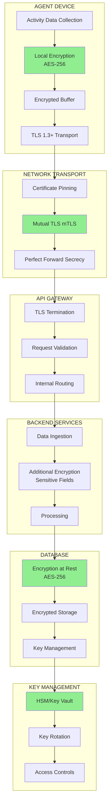

# Encryption Flow

> **Icarus Nova** | End-to-end encryption strategy protecting data in transit, at rest, and during processing.

## Overview

This document illustrates the encryption flow throughout the Workforce Monitoring Platform, from data collection on the agent to storage in the backend. Encryption is applied at multiple layers to ensure comprehensive data protection.

## Encryption Flow Diagram



## Encryption Layers

### Layer 1: Agent Local Encryption

**Location**: User Device

**Encryption:**
- **Algorithm**: AES-256
- **Mode**: GCM (Galois/Counter Mode) for authenticated encryption
- **Key Management**: Device-specific keys, derived from master key
- **Purpose**: Protect data in local buffer before transmission

**Implementation:**
- Data encrypted before leaving agent process
- Encrypted buffer stored temporarily
- Keys stored in secure storage (OS keychain/credential store)
- Keys never transmitted

### Layer 2: Transport Encryption (TLS)

**Location**: Network Communication

**Encryption:**
- **Protocol**: TLS 1.3+
- **Cipher Suites**: Strong, modern cipher suites only
- **Certificate Pinning**: Prevents MITM attacks
- **Mutual TLS (mTLS)**: Both client and server authenticated

**Implementation:**
- Agent uses pinned certificates
- Backend validates agent certificates
- Perfect Forward Secrecy enabled
- Strong cipher suites enforced
- Certificate validation strict

### Layer 3: Application-Level Encryption

**Location**: Backend Services

**Encryption:**
- **Algorithm**: AES-256 for sensitive fields
- **Purpose**: Additional protection for highly sensitive data
- **Scope**: Consent records, audit logs, personal identifiers

**Implementation:**
- Field-level encryption for sensitive data
- Encryption keys from key management service
- Transparent encryption/decryption
- Performance optimized

### Layer 4: Database Encryption at Rest

**Location**: Database Storage

**Encryption:**
- **Algorithm**: AES-256
- **Mode**: Database-level encryption
- **Key Management**: External key management service
- **Scope**: All data at rest

**Implementation:**
- Transparent Data Encryption (TDE)
- Encrypted backups
- Encrypted replication
- Key rotation support

## Key Management

### Key Hierarchy

```
Master Key (HSM)
├── Organization Keys
│   ├── Encryption Keys
│   ├── Signing Keys
│   └── Authentication Keys
└── Device Keys
    ├── Agent Certificates
    └── Device-Specific Keys
```

### Key Storage

**Hardware Security Module (HSM):**
- Master keys stored in HSM
- Key operations performed in HSM
- Key material never exposed
- FIPS 140-2 Level 3+ (where applicable)

**Key Vault:**
- Application keys in secure vault
- Access-controlled
- Audit logged
- Encrypted at rest

**Device Storage:**
- Agent keys in OS keychain
- Certificate storage secure
- Key material protected
- Access controls enforced

### Key Rotation

**Frequency:**
- Master keys: Annually or as required
- Application keys: Quarterly
- TLS certificates: As per policy (typically 90 days)
- Database keys: Per retention policy

**Process:**
- New key generation
- Gradual key migration
- Old key retention (for decryption)
- Secure key deletion
- Audit logging

## Encryption Flow Details

### Data Collection to Transmission

**Step 1: Data Collection**
- Agent collects activity data
- Data in plaintext in memory
- Minimal exposure time

**Step 2: Local Encryption**
- Data encrypted with device key
- Encrypted data stored in buffer
- Plaintext cleared from memory
- Buffer encrypted

**Step 3: TLS Preparation**
- Agent establishes TLS connection
- Certificate validation
- Key exchange (ECDHE for PFS)
- Secure channel established

**Step 4: Transmission**
- Encrypted data sent over TLS
- Double encryption (local + transport)
- Data protected in transit
- Integrity verified

### Backend Reception to Storage

**Step 1: TLS Termination**
- API Gateway terminates TLS
- Certificate validation
- Request decrypted
- Internal routing

**Step 2: Data Validation**
- Data format validation
- Schema validation
- Consent verification
- Security checks

**Step 3: Additional Encryption**
- Sensitive fields encrypted
- Field-level encryption applied
- Keys from key management
- Performance optimized

**Step 4: Database Storage**
- Data encrypted at rest
- Database-level encryption
- Key management integration
- Encrypted backups

## Security Properties

### Confidentiality

**Protection:**
- Data encrypted in transit
- Data encrypted at rest
- Keys protected
- Access controls

**Assurance:**
- Strong encryption algorithms
- Proper key management
- No plaintext exposure
- Secure key storage

### Integrity

**Protection:**
- Cryptographic hashes
- Digital signatures
- TLS integrity checks
- Database integrity

**Assurance:**
- Tamper detection
- Data validation
- Integrity verification
- Audit logging

### Authenticity

**Protection:**
- Certificate-based authentication
- Mutual TLS
- Digital signatures
- Access controls

**Assurance:**
- Strong authentication
- Certificate validation
- Non-repudiation
- Audit trails

## Performance Considerations

### Encryption Overhead

**Agent:**
- Minimal CPU impact (< 1%)
- Efficient algorithms
- Hardware acceleration (where available)
- Optimized implementation

**Backend:**
- Transparent encryption
- Database-level encryption (minimal overhead)
- Efficient key management
- Caching strategies

### Optimization Strategies

- Hardware acceleration
- Efficient algorithms
- Batch operations
- Connection pooling
- Key caching

## Compliance

### Standards Compliance

- **FIPS 140-2**: Cryptographic modules
- **Common Criteria**: Security evaluation
- **ISO 27001**: Information security
- **SOC 2**: Security controls

### Regulatory Compliance

- **GDPR**: Encryption requirements
- **LGPD**: Data protection
- **HIPAA**: Healthcare data (if applicable)
- **PCI DSS**: Payment data (if applicable)

## Monitoring and Auditing

### Encryption Monitoring

- Key usage tracking
- Encryption operation logging
- Performance metrics
- Error monitoring

### Security Auditing

- Key access logging
- Encryption event logging
- Compliance reporting
- Incident tracking

## Related Documents

- [Threat Model](../docs/threat-model.md)
- [Non-Functional Requirements](../docs/non-functional-requirements.md)
- [ADR: Data Encryption Strategy](../adr/0005-data-encryption-strategy.md)

---

**Last Updated:** 2024  
**Maintained by:** Icarus Nova Architecture Team  
**Version:** 1.0
