# Activity Session Example

> **Icarus Nova** | Conceptual example of activity data collection and processing (NOT production code).

## Overview

This document illustrates how activity data is collected, processed, and aggregated in the Workforce Monitoring Platform. This is a **conceptual example** for educational purposes and demonstrates the data flow from collection to analytics.

## Activity Session Flow

```mermaid
graph LR
    A[Agent Collects Events] --> B[Local Encryption]
    B --> C[Transmit to Backend]
    C --> D[Ingestion Service]
    D --> E[Validate & Store]
    E --> F[Publish Event]
    F --> G[Analytics Service]
    G --> H[Aggregate Data]
    H --> I[Store Aggregates]
    I --> J[Generate Metrics]
    J --> K[User Dashboard]
```



## Raw Event Collection

### Example: Application Usage Event

**Event Structure:**
```json
{
  "eventId": "event-001",
  "eventType": "application_usage",
  "userId": "user-12345",
  "organizationId": "org-67890",
  "timestamp": "2024-01-15T09:30:00Z",
  "deviceId": "device-abc123",
  "data": {
    "applicationName": "Microsoft Word",
    "applicationCategory": "Productivity",
    "action": "launch",
    "windowTitle": "Document1.docx"
  },
  "metadata": {
    "agentVersion": "1.0.0",
    "platform": "Windows",
    "consentVersion": "1.0"
  }
}
```

### Example: Window Focus Event

**Event Structure:**
```json
{
  "eventId": "event-002",
  "eventType": "window_focus",
  "userId": "user-12345",
  "organizationId": "org-67890",
  "timestamp": "2024-01-15T09:30:15Z",
  "deviceId": "device-abc123",
  "data": {
    "applicationName": "Microsoft Word",
    "windowTitle": "Document1.docx",
    "focusDuration": 0,
    "action": "focus_gained"
  },
  "metadata": {
    "agentVersion": "1.0.0",
    "platform": "Windows",
    "consentVersion": "1.0"
  }
}
```

### Example: System State Event

**Event Structure:**
```json
{
  "eventId": "event-003",
  "eventType": "system_state",
  "userId": "user-12345",
  "organizationId": "org-67890",
  "timestamp": "2024-01-15T09:45:00Z",
  "deviceId": "device-abc123",
  "data": {
    "state": "idle",
    "idleDuration": 900,
    "previousState": "active"
  },
  "metadata": {
    "agentVersion": "1.0.0",
    "platform": "Windows",
    "consentVersion": "1.0"
  }
}
```

## Activity Session Example

### Complete Session Data

**Session Overview:**
```json
{
  "sessionId": "session-20240115-user12345",
  "userId": "user-12345",
  "organizationId": "org-67890",
  "date": "2024-01-15",
  "startTime": "2024-01-15T09:00:00Z",
  "endTime": "2024-01-15T17:00:00Z",
  "totalDuration": 28800,
  "activeDuration": 25200,
  "idleDuration": 3600,
  "applications": [
    {
      "applicationName": "Microsoft Word",
      "category": "Productivity",
      "totalTime": 7200,
      "sessions": 3,
      "firstUsed": "2024-01-15T09:15:00Z",
      "lastUsed": "2024-01-15T16:30:00Z"
    },
    {
      "applicationName": "Google Chrome",
      "category": "Web Browser",
      "totalTime": 5400,
      "sessions": 5,
      "firstUsed": "2024-01-15T09:30:00Z",
      "lastUsed": "2024-01-15T16:45:00Z"
    },
    {
      "applicationName": "Visual Studio Code",
      "category": "Development",
      "totalTime": 10800,
      "sessions": 2,
      "firstUsed": "2024-01-15T10:00:00Z",
      "lastUsed": "2024-01-15T15:00:00Z"
    }
  ],
  "categories": {
    "Productivity": 7200,
    "Web Browser": 5400,
    "Development": 10800,
    "Other": 1800
  },
  "networkActivity": {
    "totalBytes": 524288000,
    "inboundBytes": 262144000,
    "outboundBytes": 262144000
  }
}
```

## Aggregated Metrics

### Daily Aggregation Example

**Daily Summary:**
```json
{
  "aggregationId": "daily-20240115-user12345",
  "userId": "user-12345",
  "organizationId": "org-67890",
  "date": "2024-01-15",
  "metrics": {
    "totalActiveTime": 25200,
    "totalIdleTime": 3600,
    "totalSessionTime": 28800,
    "productivityScore": 87.5,
    "applicationsUsed": 12,
    "categoriesUsed": 5,
    "networkUsage": {
      "totalBytes": 524288000,
      "averageBytesPerHour": 65536000
    }
  },
  "timeDistribution": {
    "Productivity": 0.25,
    "Development": 0.375,
    "Web Browser": 0.188,
    "Communication": 0.125,
    "Other": 0.062
  },
  "topApplications": [
    {
      "applicationName": "Visual Studio Code",
      "category": "Development",
      "time": 10800,
      "percentage": 0.375
    },
    {
      "applicationName": "Microsoft Word",
      "category": "Productivity",
      "time": 7200,
      "percentage": 0.25
    },
    {
      "applicationName": "Google Chrome",
      "category": "Web Browser",
      "time": 5400,
      "percentage": 0.188
    }
  ],
  "createdAt": "2024-01-15T23:59:59Z"
}
```

### Weekly Aggregation Example

**Weekly Summary:**
```json
{
  "aggregationId": "weekly-2024w03-user12345",
  "userId": "user-12345",
  "organizationId": "org-67890",
  "week": "2024-W03",
  "startDate": "2024-01-15",
  "endDate": "2024-01-21",
  "metrics": {
    "totalActiveTime": 126000,
    "averageDailyActiveTime": 18000,
    "totalSessionTime": 144000,
    "averageProductivityScore": 85.2,
    "applicationsUsed": 15,
    "categoriesUsed": 6
  },
  "timeDistribution": {
    "Productivity": 0.28,
    "Development": 0.35,
    "Web Browser": 0.20,
    "Communication": 0.12,
    "Other": 0.05
  },
  "trends": {
    "productivityTrend": "increasing",
    "activeTimeTrend": "stable",
    "applicationDiversityTrend": "increasing"
  },
  "createdAt": "2024-01-21T23:59:59Z"
}
```

## Productivity Metrics

### Calculated Metrics Example

**Productivity Analysis:**
```json
{
  "userId": "user-12345",
  "period": "2024-01-15",
  "metrics": {
    "productivityScore": 87.5,
    "focusTime": 21600,
    "distractionTime": 3600,
    "efficiencyRatio": 0.857,
    "applicationSwitches": 45,
    "averageSessionLength": 1800,
    "deepWorkSessions": 3,
    "shallowWorkSessions": 8
  },
  "insights": {
    "mostProductiveHours": ["10:00-12:00", "14:00-16:00"],
    "leastProductiveHours": ["09:00-10:00", "17:00-18:00"],
    "primaryWorkCategory": "Development",
    "timeManagement": "good",
    "focusLevel": "high"
  }
}
```

## Data Processing Pipeline

### Step 1: Event Collection

**Agent collects events:**
- Application usage events
- Window focus events
- System state events
- Network activity events

**Events are:**
- Timestamped
- Tagged with user/organization
- Encrypted locally
- Buffered for transmission

### Step 2: Data Ingestion

**Ingestion Service:**
- Receives encrypted events
- Validates event format
- Verifies consent status
- Enriches with metadata
- Stores in database

### Step 3: Event Processing

**Analytics Service:**
- Consumes events from queue
- Validates event data
- Processes events
- Calculates metrics
- Aggregates data

### Step 4: Aggregation

**Aggregation Process:**
- Events aggregated by time period
- Metrics calculated
- Trends identified
- Insights generated

### Step 5: Storage

**Data Storage:**
- Raw events: 90 days
- Daily aggregates: 1 year
- Weekly aggregates: 3 years
- Monthly aggregates: 7 years

## Privacy-Preserving Features

### Data Minimization

**What is Collected:**
- Application names (not content)
- Time spent (not activity details)
- Categories (not specific tasks)
- Aggregated metrics (not raw events)

**What is NOT Collected:**
- Keystrokes
- Screen content
- File contents
- Personal communications
- Passwords

### Aggregation

**Aggregation Strategy:**
- Raw events aggregated quickly
- Individual events not retained long-term
- Aggregated data preserves privacy
- Trends visible without granular data

## Key Takeaways

1. **Minimal Data**: Only necessary data collected
2. **Aggregation**: Data aggregated for privacy
3. **Transparency**: Users can see their data
4. **Privacy**: No invasive monitoring
5. **Productivity Focus**: Metrics focus on productivity, not surveillance

## Related Documents

- [Data Collection Boundaries](../diagrams/data-collection-boundaries.md)
- [Agent Architecture](../agent/architecture.md)
- [Backend Architecture](../backend/architecture.md)

---

**Note:** This is a conceptual example for educational purposes. Production implementations should include proper error handling, security, compliance, and performance optimizations specific to your environment.

**Last Updated:** 2024  
**Maintained by:** Icarus Nova Architecture Team
