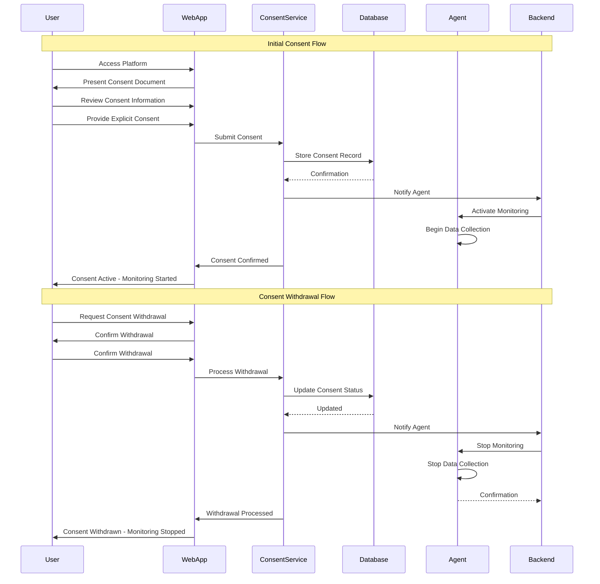

# Consent Flow Example

> **Icarus Nova** | Conceptual example of the consent flow process (NOT production code).

## Overview

This document illustrates the consent flow process in the Workforce Monitoring Platform. This is a **conceptual example** for educational purposes and demonstrates how consent is obtained, managed, and enforced.

## Consent Flow Diagram



## Step-by-Step Consent Flow

### Phase 1: Consent Presentation

**Step 1: User Access**
- User accesses the Workforce Monitoring Platform
- User is authenticated via Identity Provider
- User is presented with consent document

**Step 2: Consent Information**
- Consent document clearly explains:
  - What data is collected
  - What data is NOT collected
  - How data is used
  - Who has access to data
  - Data retention period
  - User rights
  - How to withdraw consent

**Step 3: User Review**
- User reviews consent document
- User can ask questions
- User understands monitoring scope
- User is informed about their rights

### Phase 2: Consent Capture

**Step 4: Explicit Consent**
- User provides explicit consent
- Consent is captured with:
  - Timestamp
  - User identification
  - IP address and device information
  - Consent document version
  - Consent method

**Step 5: Consent Storage**
- Consent record stored in database
- Consent record is immutable
- Consent record encrypted
- Audit log entry created

**Step 6: Consent Activation**
- Consent Service validates consent
- Consent Service notifies backend
- Backend notifies agent
- Agent activates monitoring
- User receives confirmation

### Phase 3: Monitoring Operation

**Step 7: Active Monitoring**
- Agent collects activity data (with consent)
- Data transmitted to backend
- Data processed and stored
- User can view their data
- Monitoring continues while consent active

### Phase 4: Consent Withdrawal (Optional)

**Step 8: Withdrawal Request**
- User requests consent withdrawal
- User confirms withdrawal intention
- Withdrawal request submitted

**Step 9: Withdrawal Processing**
- Consent Service processes withdrawal
- Consent status updated in database
- Backend notified
- Agent notified to stop monitoring
- Monitoring stops immediately

**Step 10: Withdrawal Confirmation**
- User receives confirmation
- Data collection stopped
- Existing data retained per retention policy
- User retains access to historical data

## Consent Document Example

### Consent Document Structure

```markdown
# Workforce Monitoring Consent

## What We Monitor

We collect the following data:
- Application usage (name, category, time)
- Window focus events (application, duration)
- System state (idle/active)
- Network activity volume (not content)

## What We Do NOT Monitor

We explicitly do NOT collect:
- Keystrokes
- Screen content
- File contents
- Personal communications
- Passwords
- Personal browsing

## How We Use Your Data

- Productivity analysis
- Time tracking
- Compliance reporting
- Business insights

## Who Has Access

- You: Full access to your own data
- Your Manager: Aggregated team data only
- Administrators: Organization-wide data (with authorization)
- Auditors: Audit logs and compliance data

## Data Retention

- Raw events: 90 days
- Daily aggregates: 1 year
- Monthly aggregates: 3 years

## Your Rights

- Access your data
- Export your data
- Correct your data
- Request deletion
- Withdraw consent at any time

## How to Withdraw Consent

You can withdraw consent at any time through:
- Web application
- Contacting support
- Email request

Withdrawal takes effect immediately.

## Consent Version

This consent document is version 1.0, dated 2024-01-01.

[ ] I have read and understand this consent document
[ ] I provide explicit consent for monitoring as described
[ ] I understand I can withdraw consent at any time

[Submit Consent] [Cancel]
```

## Consent Record Example

### Database Record Structure

```json
{
  "consentId": "consent-12345",
  "userId": "user-67890",
  "organizationId": "org-11111",
  "consentVersion": "1.0",
  "consentDocumentId": "doc-v1.0",
  "consentStatus": "active",
  "consentTimestamp": "2024-01-01T10:00:00Z",
  "consentMethod": "web",
  "ipAddress": "192.168.1.100",
  "deviceInfo": {
    "userAgent": "Mozilla/5.0...",
    "platform": "Windows"
  },
  "withdrawalTimestamp": null,
  "createdAt": "2024-01-01T10:00:00Z",
  "updatedAt": "2024-01-01T10:00:00Z"
}
```

## Consent Withdrawal Record Example

```json
{
  "consentId": "consent-12345",
  "userId": "user-67890",
  "withdrawalTimestamp": "2024-06-01T14:30:00Z",
  "withdrawalMethod": "web",
  "withdrawalReason": "user_requested",
  "ipAddress": "192.168.1.100",
  "deviceInfo": {
    "userAgent": "Mozilla/5.0...",
    "platform": "Windows"
  },
  "updatedAt": "2024-06-01T14:30:00Z"
}
```

## Consent Status States

### Active
- Consent is active
- Monitoring is enabled
- Data collection occurs
- User can view their data

### Withdrawn
- Consent has been withdrawn
- Monitoring is stopped
- No new data collection
- Existing data retained per policy

### Expired
- Consent period expired (if time-limited)
- Monitoring stopped
- Re-consent required
- Existing data retained per policy

### Pending
- Consent request submitted
- Awaiting activation
- Monitoring not yet started
- User notified

## Consent Versioning

### Policy Updates

When monitoring policies change:

1. **New Policy Version Created**
   - Policy version incremented
   - Changes documented
   - New consent document created

2. **Users Notified**
   - Users notified of policy changes
   - Changes explained clearly
   - Re-consent deadline provided

3. **Grace Period**
   - Users have time to review
   - Old consent remains valid during grace period
   - Monitoring continues under old consent

4. **Re-Consent Required**
   - New consent required after grace period
   - Monitoring continues if re-consent provided
   - Monitoring stops if re-consent not provided

## Consent Audit Trail

### Audit Log Entry Example

```json
{
  "auditId": "audit-99999",
  "eventType": "consent_provided",
  "userId": "user-67890",
  "consentId": "consent-12345",
  "timestamp": "2024-01-01T10:00:00Z",
  "ipAddress": "192.168.1.100",
  "deviceInfo": {
    "userAgent": "Mozilla/5.0...",
    "platform": "Windows"
  },
  "consentVersion": "1.0",
  "action": "consent_provided",
  "result": "success"
}
```

## Key Takeaways

1. **Explicit Consent Required**: No monitoring without explicit consent
2. **Clear Information**: Users understand what they're consenting to
3. **Easy Withdrawal**: Consent can be withdrawn easily
4. **Immediate Effect**: Withdrawal takes effect immediately
5. **Audit Trail**: All consent actions are logged
6. **Version Control**: Consent tied to policy versions
7. **User Control**: Users have full control over their consent

## Related Documents

- [Consent Model](../docs/consent-model.md)
- [Privacy by Design](../docs/privacy-by-design.md)
- [Legal Considerations](../docs/legal-considerations.md)

---

**Note:** This is a conceptual example for educational purposes. Production implementations should include proper error handling, security, compliance, and user experience optimizations specific to your environment.

**Last Updated:** 2024  
**Maintained by:** Icarus Nova Architecture Team
